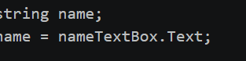

Chapter 2 – Processing Data

📚 Chapter Overview

Chapter 2 explains how to work with data in Visual C#.

In this chapter, we learn about:

- TextBox controls
- Text property
- Variables
- String concatenation

---

1. Reading Input with TextBox Controls

A TextBox allows the user to enter information.

It is found in the Common Controls section of the Toolbox.

---

2. Text Property

The Text property stores the user input in a TextBox.

[screenshot](chapter0202-text-property.png.png)

---

3. Variables

A variable is a storage location in memory.

A variable must be declared before it is used.

Syntax

DataType VariableName;

---

4. String Concatenation

Concatenation means joining one string with another string.

C# uses the "+" operator for concatenation.

Example

string firstName = "Aisha";
string lastName = "Abdullahi";

string fullName = firstName + " " + lastName;

Result:

Aisha Abdullahi

A string can also be combined with numbers.

---

📝 Chapter 2 – Quick Review

Topic| Meaning
TextBox| Gets user input
Text Property| Stores text
Variable| Stores data
String| Stores text
Concatenation| Joins strings
"+"| Joins values

🎯 Chapter Summary

Chapter 2 introduces basic data processing in Visual C#. We learned how to get input from a TextBox, use the Text property, create variables, and join strings using concatenation.