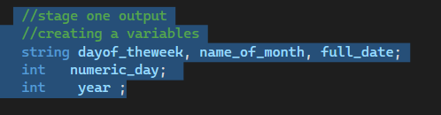
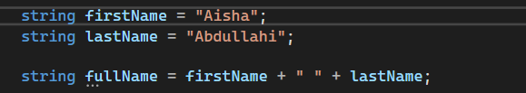

Chapter 2 – Processing Data

📚 Chapter Overview

Chapter 2 explains how to work with data in Visual C#.

We will learn:

- How to read input from a TextBox
- How to use variables
- Different data types
- How to perform calculations
- How to convert data types
- How to handle errors
- Constants and fields
- The Math class
- Debugging

---

1. Reading Input with TextBox

A TextBox allows the user to enter information.

"TextBox" — 
![screenshot]/chapter02/01-textbox.png.png

---

2. Text Property

The Text property stores the text in a TextBox.

"Text Property" — 
![screenshot]chapter02/02-text-property.png.png

---

3. Variables

A variable is used to store data.

DataType VariableName;

"Variables"

---

4. Variable Names

Variable names identify variables.

Rules

- Start with a letter or "_"
- No spaces
- Do not use keywords
- Use meaningful names

Examples

studentName
totalAmount
_score
age

❌ Invalid:

student name

📸 Screenshot – Variable Names

«Add screenshot here.»

"Variable Names" — "Screenshots/chapter02/05variable-names.png"

---

6. String Variables

A string stores text.

Example

string university = "Jamhuriya University";

MessageBox.Show(university);

📸 Screenshot – String Variable

«Add screenshot here.»

"String Variable" — "screenshots/chapter02/06-string.png"

---

7. String Concatenation

Concatenation means joining strings together.

C# uses the "+" operator.

Example

string firstName = "Aisha";
string lastName = "Abdullahi";

string fullName = firstName + " " + lastName;

Result:

Aisha Abdullahi

📸 Screenshot – String Concatenation

«Add screenshot here.»

"String Concatenation"
— "screenshots/chapter02/07concatenation.png"

---

8. Local Variables

A local variable is declared inside a method.

Example

private void button1_Click(object sender, EventArgs e)
{
    string name = "Aisha";

    MessageBox.Show(name);
}

The variable can be used inside this method.

📸 Screenshot – Local Variable

«Add screenshot here.»

"Local Variable" — "screenshots/chapter02/08-local-variable.png"

---

9. Initializing Variables

A variable should have a value before it is used.

Example

string name;

name = "Aisha";

MessageBox.Show(name);

📸 Screenshot – Initializing Variables

«Add screenshot here.»

"Initializing Variables" — "screenshots/chapter02/09-initializing.png"

---

10. Numeric Data Types

Numeric types are used for numbers.

- "int" → Whole numbers
- "double" → Decimal numbers
- "decimal" → Precise decimal numbers

Example

int hoursWorked = 40;
double temperature = 87.6;
decimal payRate = 28.75m;

📸 Screenshot – Numeric Data Types

«Add screenshot here.»

"Numeric Data Types" — "screenshots/chapter02/10-numeric-types.png"

---

11. Numeric Literals

A numeric literal is a number written directly in code.

Example

int hoursWorked = 40;
double temperature = 87.6;
decimal payRate = 28.75m;

- "40" → Integer
- "87.6" → Double
- "28.75m" → Decimal

📸 Screenshot – Numeric Literals

«Add screenshot here.»

"Numeric Literals" — "screenshots/chapter02/11-numeric-literals.png"

---

12. Type Casting

Type casting changes a value from one data type to another.

Example

decimal money = 4500m;

int number = (int)money;

📸 Screenshot – Type Casting

«Add screenshot here.»

"Type Casting" — "screenshots/chapter02/12-type-casting.png"

---

13. "var" Keyword

"var" allows C# to determine the data type automatically.

Example

var age = 20;
var name = "Aisha";
var balance = 1000.0m;

The type is determined from the value.

📸 Screenshot – var Keyword

«Add screenshot here.»

"var Keyword" — "screenshots/chapter02/13-var.png"

---

14. Performing Calculations

C# uses arithmetic operators.

Operator| Meaning
"+"| Addition
"-"| Subtraction
"*"| Multiplication
"/"| Division
"%"| Remainder

Example

int x = 5;
int y = 4;

int result = x + y;

MessageBox.Show(result.ToString());

Result:

9

📸 Screenshot – Calculations

«Add screenshot here.»

"Calculations" — "screenshots/chapter02/14-calculations.png"

---

15. Integer Division

When two integers are divided, the result is an integer.

Example

int x = 7;
int y = 3;

MessageBox.Show((x / y).ToString());

Result:

2

📸 Screenshot – Integer Division

«Add screenshot here.»

"Integer Division" — "screenshots/chapter02/15-integer-division.png"

---

16. Inputting Numeric Values

TextBox input is stored as a string.

"Parse()" can convert it to a number.

Example

int age = int.Parse(ageTextBox.Text);

Other examples:

double temperature =
    double.Parse(temperatureTextBox.Text);

decimal price =
    decimal.Parse(priceTextBox.Text);

📸 Screenshot – Parse

«Add screenshot here.»

"Parse" — "screenshots/chapter02/16-parse.png"

---

17. "ToString()" Method

"ToString()" converts a value to a string.

Example

int number = 123;

MessageBox.Show(number.ToString());

It can also be used with a Label:

double price = 25.50;

priceLabel.Text = price.ToString();

📸 Screenshot – ToString

«Add screenshot here.»

"ToString" — "screenshots/chapter02/17-tostring.png"

---

18. Formatting Numbers

"ToString()" can format numbers.

Format| Meaning
""N""| Number
""F""| Fixed-point
""E""| Exponential
""C""| Currency
""P""| Percentage

Example

double number = 12.3;

MessageBox.Show(number.ToString("n3"));

Result:

12.300

📸 Screenshot – Number Formatting

«Add screenshot here.»

"Number Formatting" — "screenshots/chapter02/18-formatting.png"

---

19. Exception Handling

An exception is an error that happens while a program is running.

Examples:

- Invalid input
- Dividing by zero
- Missing files

Exception handling helps the program handle errors.

📸 Screenshot – Exception Handling

«Add screenshot here.»

"Exception Handling" — "screenshots/chapter02/19-exception.png"

---

20. "try-catch"

"try" contains code that may cause an error.

"catch" handles the error.

Example

try
{
    int number = int.Parse(textBox1.Text);

    MessageBox.Show(number.ToString());
}
catch
{
    MessageBox.Show("Invalid data.");
}

📸 Screenshot – Try Catch

«Add screenshot here.»

"Try Catch" — "screenshots/chapter02/20-try-catch.png"

---

21. Throwing and Catching

Throwing means an error occurs.

Catching means the program handles the error.

Throwing → Problem happens
Catching → Program handles it

📸 Screenshot – Throwing and Catching

«Add screenshot here.»

"Throwing Catching" — "screenshots/chapter02/21-throwing-catching.png"

---

22. Exception Message

An exception has a "Message" property.

Example

try
{
    int number = int.Parse(textBox1.Text);
}
catch (Exception ex)
{
    MessageBox.Show(ex.Message);
}

📸 Screenshot – Exception Message

«Add screenshot here.»

"Exception Message" — "screenshots/chapter02/22-exception-message.png"

---

23. Named Constants

A constant is a value that cannot be changed.

Use the "const" keyword.

Example

const double INTEREST_RATE = 0.129;

📸 Screenshot – Named Constants

«Add screenshot here.»

"Named Constants" — "screenshots/chapter02/23-constants.png"

---

24. Fields

A field is a variable declared at class level.

Example

public partial class Form1 : Form
{
    private string name = "Aisha";
}

📸 Screenshot – Fields

«Add screenshot here.»

"Fields" — "screenshots/chapter02/24-field.png"

---

25. Math Class

The "Math" class is used for mathematical calculations.

Common Methods

Math.Sqrt(x)
Math.Pow(x, y)
Math.Max(x, y)
Math.Min(x, y)
Math.Round(x)

Constants

Math.PI
Math.E

Example

double answer = Math.Sqrt(25);

MessageBox.Show(answer.ToString());

Result:

5

📸 Screenshot – Math Class

«Add screenshot here.»

"Math Class" — "screenshots/chapter02/25-math.png"

---

26. Tab Order

Tab Order controls the order of controls when the user presses "Tab".

Example

Name TextBox → TabIndex 0
Age TextBox  → TabIndex 1
Button       → TabIndex 2

📸 Screenshot – Tab Order

«Add screenshot here.»

"Tab Order" — "screenshots/chapter02/26-tab-order.png"

---

27. Focus Method

"Focus()" gives keyboard focus to a control.

Example

nameTextBox.Focus();

📸 Screenshot – Focus Method

«Add screenshot here.»

"Focus Method" — "screenshots/chapter02/27-focus.png"

---

28. Keyboard Access Keys

Access keys allow users to access controls with the "Alt" key.

Example

&Exit

The user can press:

Alt + X

📸 Screenshot – Access Keys

«Add screenshot here.»

"Access Keys" — "screenshots/chapter02/28-access-key.png"

---

29. Setting Colors

Controls have color properties.

"BackColor"

Sets the background color.

"ForeColor"

Sets the text color.

Example

messageLabel.BackColor = Color.Black;
messageLabel.ForeColor = Color.Yellow;

📸 Screenshot – Colors

«Add screenshot here.»

"Colors" — "screenshots/chapter02/29-colors.png"

---

30. Background Images

A Form can have a background image.

The "BackgroundImageLayout" property controls how the image appears.

Options:

- None
- Tile
- Center
- Stretch
- Zoom

📸 Screenshot – Background Image

«Add screenshot here.»

"Background Image" — "screenshots/chapter02/30-background-image.png"

---

31. GroupBox vs Panel

Both are containers for controls.

GroupBox

- Has a border
- Can have a title
- Has a "Text" property

Panel

- Can contain controls
- Has a "BorderStyle" property
- Does not have a title

📸 Screenshot – GroupBox and Panel

«Add screenshot here.»

"GroupBox Panel" — "screenshots/chapter02/31-groupbox-panel.png"

---

32. Logic Errors

A logic error produces the wrong result even though the program runs.

Examples:

- Wrong calculation
- Wrong variable
- Wrong value

Debugging tools help find logic errors.

📸 Screenshot – Logic Error

«Add screenshot here.»

"Logic Error" — "screenshots/chapter02/32-logic-error.png"

---

33. Breakpoints

A breakpoint pauses the program at a specific line.

Program Running
      ↓
  Breakpoint
      ↓
Program Pauses
      ↓
 Check Values

📸 Screenshot – Breakpoint

«Add screenshot here.»

"Breakpoint" — "screenshots/chapter02/33-breakpoint.png"

---

34. Break Mode

Break Mode happens when the program pauses at a breakpoint.

You can check variable values.

Example

int age = 20;

📸 Screenshot – Break Mode

«Add screenshot here.»

"Break Mode" — "screenshots/chapter02/34-break-mode.png"

---

35. Locals and Watch Windows

Locals Window

Shows variables in the current method.

It shows:

- Name
- Value
- Type

Watch Window

Allows you to watch selected variables.

📸 Screenshot – Locals and Watch

«Add screenshot here.»

"Locals and Watch" — "screenshots/chapter02/35-locals-watch.png"

---

36. Single-Stepping

Single-stepping runs the program one statement at a time.

It is useful for debugging.

Shortcut

F11

Or:

Debug → Step Into

📸 Screenshot – Single-Stepping

«Add screenshot here.»

"Single Stepping" — "screenshots/chapter02/36-single-stepping.png"

---

📝 Chapter 2 – Quick Review

Concept| Meaning
TextBox| Gets user input
Variable| Stores data
"string"| Stores text
"int"| Whole numbers
"double"| Decimal numbers
"decimal"| Precise decimal values
"var"| Finds the type automatically
"+"| Addition / joining text
"/"| Division
"%"| Remainder
"Parse()"| Converts text to a number
"ToString()"| Converts a value to text
"try-catch"| Handles errors
"const"| Constant value
Field| Class-level variable
"Math"| Math calculations
"TabIndex"| Controls tab order
Breakpoint| Pauses the program
Debugging| Finds program errors

🎯 Chapter Summary

Chapter 2 explains how to work with data in Visual C#. We learn about TextBoxes, variables, data types, calculations, exceptions, constants, the Math class, and debugging tools.